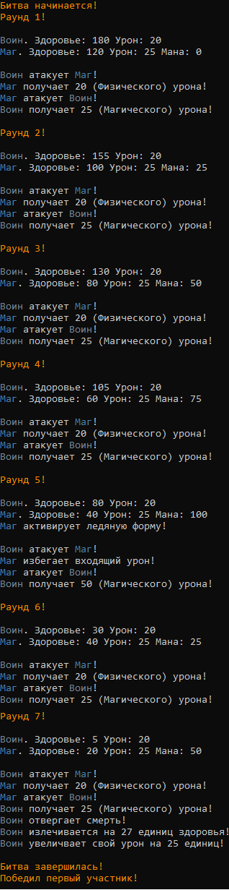

# Арена гладиаторов
Программа для симуляции битв героев на арене.
Бой на арене проходит между двумя участниками.
Представлено 5 уникальных героев, обладающих различными способностями.

## Примеры

Воин против Мага

Вампир против Голема

Вампир против Рыцарь Хаоса

